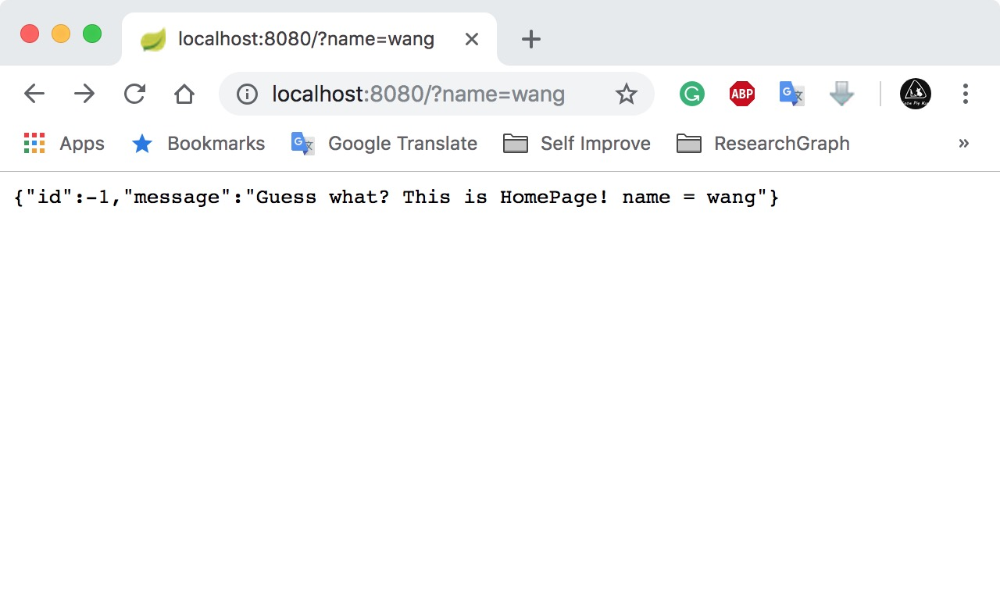
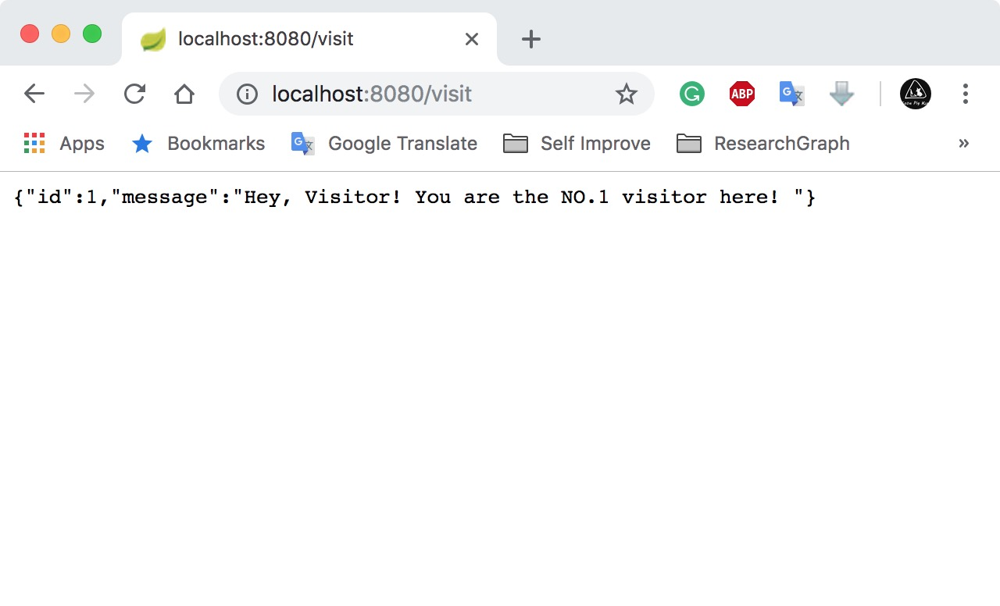

# 搭建一个RESTful服务器
 
## 实现功能

* 处理基本的HTTP请求，返回JSON格式的对象
* 进行简单的计数

## 环境 & 工具
* Mac OS Version 10.13.4

    * java version "1.8.0_102"
    * Java(TM) SE Runtime Environment (build 1.8.0_102-b14)
    * Java HotSpot(TM) 64-Bit Server VM (build 25.102-b14, mixed mode)

* VS Code / IntelliJ IDEA

## 具体步骤
因为没有购买IntelliJ IDEA Ultimate版本，因此我选择使用 VS Code 初始化该项目。VS Code 插件市场有spring的官方插件，很好用。

1. 初始化

    如图所示，使用VS Code 提供的插件，可以方便的生产一个Spring project, 跟着提示走就行。这里选择 Maven project。

    当然这里有也很多种方法新建project

    * Spring 官方网站 [https://start.spring.io/](https://start.spring.io/)
    
        这个基本跟VS Code一模一样。个人觉得还是VS Code更方便，直接本地生成，也免得下载zip包解压的过程。而且可能是操作的问题，第一次下载zip包并尝试用IntelliJ CE版本编码的时候，配置也出现一些问题。

    * IntelliJ IDEA Ultimate版本有支持spring的扩展

        毕竟我很穷，没有正版码。没有尝试。不建议在网上搜索注册码，用的话还是支持正版。

    * 新建 Maven / Gradle project 手动配置。

        这样可能可以更透彻的理解spring框架。有时间 && 精力 && 兴趣 可以自行尝试。

    Spring project 基本款 get✅

    截图展示了程序结构及pom.xml的一部分，重点关注dependencies部分：


2. 建立返回类

我们希望服务器可以处理HTTP请求（如GET， POST等），并对访问进行一个简单的计数，并且返回一个简单的message，something like：

```
{
    "id" : 1,
    "message" : "Hey, Kun! You are the NO.1 visitor here! "
}
```

我们可以返回一个Java对象，Spring使用[Jackson JSON](https://github.com/FasterXML/jackson) library 将其转化为JSON。

我们在```src/main/java/com/kun/restful_web_service``` 下新建一个简单的java类```Message.java```

代码如下：

```java
package com.kun.restful_web_service;

public class Message {

    private final long id;
    private final String message;

    public Message(long id, String message) {
        this.id = id;
        this.message = message;
    }

    public long getId() {
        return id;
    }

    public String getMessage() {
        return message;
    }
}
```

3. 建立Controller
在Spring RESTful web services中，HTTP请求是由Controller控制的。

    ```@RestController``` 表明该类为RESTful Controller

    ```@RequestMapping``` 确保HTTP请求对应相应的方法

    ```@RequestParam``` 用来获取Query中的参数

    我们在```src/main/java/com/kun/restful_web_service``` 下新建一个简单的java类```MessageController.java```
    
    代码如下：
```java
package com.kun.restful_web_service;

import java.util.concurrent.atomic.AtomicLong;
import org.springframework.web.bind.annotation.RequestMapping;
import static org.springframework.web.bind.annotation.RequestMethod.*;
import org.springframework.web.bind.annotation.RequestParam;
import org.springframework.web.bind.annotation.RestController;

@RestController         //标记为Controller
public class MessageController {

    private static final String template = "Hey, %s! You are the NO.%s visitor here! ";
    private final AtomicLong counter = new AtomicLong();

     //for http://localhost:8080/visit
    //@RequestMapping("/visit")                             默认所有HTTP请求
    //@RequestMapping(method=GET, value="/visit")           仅处理GET请求
    @RequestMapping(method={GET, POST}, value="/visit")     //处理GET 或POST请求
    public Message visit(@RequestParam(value="name", defaultValue="Visitor") String name) { //name 取query中的name值，默认值为"Visitors"
        return new Message(counter.incrementAndGet(),
                            String.format(template, name, counter.toString()));
    }
    //for http://localhost:8080
    @RequestMapping("/")
    public Message myGreeting(@RequestParam(value = "name", defaultValue = "kun") String name) {
        
        return new Message(-1, "Guess what? This is HomePage! name = " + name);
    }
}
```

4. 运行程序

与任何java的程序一样，Spring会寻找
```java 
public static void main(String[] args)
```
作为程序入口，在程序初始化是，已经产生了```DemoApplication.java```
 文件，我们可以将它改成我们希望的名字, 这里我将它改为```Application.java```

 现在代码部分结束，我们需要build可运行的jar包：
 对于Maven，运行 
 ```
    ./mvnw spring-boot:run
 ```
 或者
 ```
   ./mvnw clean package

```

在 VS Code 或 IntelliJ 或大部分IDE中，我们可以省去这个步骤，直接点击运行即可：


5. 测试

    1. 
    [http://localhost:8080](http://localhost:8080)
    
    2.     
    [http://localhost:8080/?name=wang](http://localhost:8080/?name=wang)
    
    3. 
    [http://localhost:8080/visit](http://localhost:8080/visit)
    
    4.     
    [http://localhost:8080/visit/?name=kun](http://localhost:8080/visit/?name=kun)
    


