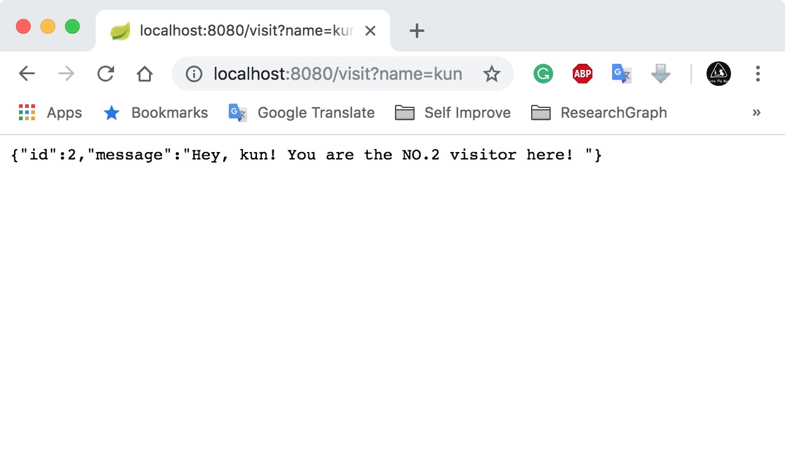
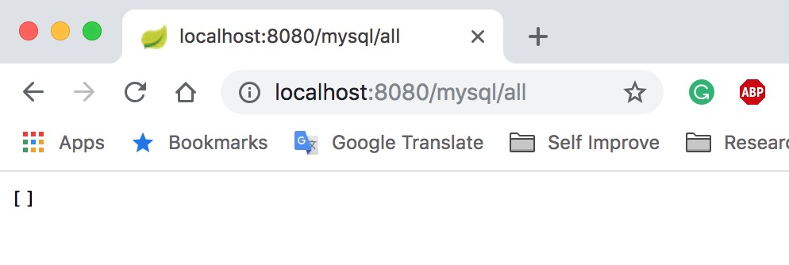

[第一课：搭建一个RESTful服务器](https://github.com/KunWang10/spring-tutorial/blob/master/README.md#%E7%AC%AC%E4%B8%80%E8%AF%BE%E6%90%AD%E5%BB%BA%E4%B8%80%E4%B8%AArestful%E6%9C%8D%E5%8A%A1%E5%99%A8)

[第二课：连接MySQL](#第二课：连接MySQL)

# 第一课：搭建一个RESTful服务器
 
## 实现功能

* 处理基本的HTTP请求，返回JSON格式的对象
* 进行简单的计数

## 环境 & 工具
* Mac OS Version 10.13.4
    * java version "1.8.0_102"
    * Java(TM) SE Runtime Environment (build 1.8.0_102-b14)
    * Java HotSpot(TM) 64-Bit Server VM (build 25.102-b14, mixed mode)
* VS Code / IntelliJ IDEA

## 具体步骤
因为没有购买IntelliJ IDEA Ultimate版本，因此我选择使用 VS Code 初始化该项目。VS Code 插件市场有spring的官方插件，很好用。

1. 初始化

    如图所示，使用VS Code 提供的插件，可以方便的生产一个Spring project, 跟着提示走就行。这里选择 Maven project。


    当然这里有也很多种方法新建project

    * Spring 官方网站 [https://start.spring.io/](https://start.spring.io/)
    
        这个基本跟VS Code一模一样。个人觉得还是VS Code更方便，直接本地生成，也免得下载zip包解压的过程。而且可能是操作的问题，第一次下载zip包并尝试用IntelliJ CE版本编码的时候，配置也出现一些问题。

    * IntelliJ IDEA Ultimate版本有支持spring的扩展

        毕竟我很穷，没有正版码。没有尝试。不建议在网上搜索注册码，用的话还是支持正版。

    * 新建 Maven / Gradle project 手动配置。

        这样可能可以更透彻的理解spring框架。有时间 && 精力 && 兴趣 可以自行尝试。

    Spring project 基本款 get✅

    截图展示了程序结构及pom.xml的一部分，重点关注dependencies部分：


2. 建立返回类

我们希望服务器可以处理HTTP请求（如GET， POST等），并对访问进行一个简单的计数，并且返回一个简单的message，something like：

```JSON
{
    "id" : 1,
    "message" : "Hey, Kun! You are the NO.1 visitor here! "
}
```

我们可以返回一个Java对象，Spring使用[Jackson JSON](https://github.com/FasterXML/jackson) library 将其转化为JSON。

我们在```src/main/java/com/kun/restful_web_service``` 下新建一个简单的java类```Message.java```

代码如下：

```java
package com.kun.restful_web_service;

public class Message {

    private final long id;
    private final String message;

    public Message(long id, String message) {
        this.id = id;
        this.message = message;
    }

    public long getId() {
        return id;
    }

    public String getMessage() {
        return message;
    }
}
```

3. 建立Controller
    在Spring RESTful web services中，HTTP请求是由Controller控制的。

    ```@RestController``` 表明该类为RESTful Controller

    ```@RequestMapping``` 确保HTTP请求对应相应的方法

    ```@RequestParam``` 用来获取Query中的参数

    我们在```src/main/java/com/kun/restful_web_service``` 下新建一个简单的java类```MessageController.java```
    
    代码如下：
    ```java
    package com.kun.restful_web_service;

    import java.util.concurrent.atomic.AtomicLong;
    import org.springframework.web.bind.annotation.RequestMapping;
    import static org.springframework.web.bind.annotation.RequestMethod.*;
    import org.springframework.web.bind.annotation.RequestParam;
    import org.springframework.web.bind.annotation.RestController;

    @RestController         //标记为Controller
    public class MessageController {

        private static final String template = "Hey, %s! You are the NO.%s visitor here! ";
        private final AtomicLong counter = new AtomicLong();

        //for http://localhost:8080/visit
        //@RequestMapping("/visit")                             默认所有HTTP请求
        //@RequestMapping(method=GET, value="/visit")           仅处理GET请求
        @RequestMapping(method={GET, POST}, value="/visit")     //处理GET 或POST请求
        public Message visit(@RequestParam(value="name", defaultValue="Visitor") String name) { //name 取query中的name值，默认值为"Visitors"
            return new Message(counter.incrementAndGet(),
                                String.format(template, name, counter.toString()));
        }
        //for http://localhost:8080
        @RequestMapping("/")
        public Message myGreeting(@RequestParam(value = "name", defaultValue = "kun") String name) {
            
            return new Message(-1, "Guess what? This is HomePage! name = " + name);
        }
    }
    ```

4. 运行程序

    与任何java的程序一样，Spring会寻找
    ```java 
    public static void main(String[] args)
    ```
    作为程序入口，在程序初始化是，已经产生了```DemoApplication.java```
    文件，我们可以将它改成我们希望的名字, 这里我将它改为```Application.java```

    代码如下:
    ```java
    package com.kun.restful_web_service;

    import org.springframework.boot.SpringApplication;
    import org.springframework.boot.autoconfigure.SpringBootApplication;

    @SpringBootApplication
    public class Application {

        public static void main(String[] args) {
            SpringApplication.run(Application.class, args);
        }
    }

    ```

    现在代码部分结束，我们需要build可运行的jar包：
    对于Maven，运行 
    ```
        ./mvnw spring-boot:run
    ```
    或者
    ```
    ./mvnw clean package

    ```

    在 VS Code 或 IntelliJ 或大部分IDE中，我们可以省去这个步骤，直接点击运行即可：

    

    

5. 测试

    1. http://localhost:8080/, id始终为-1, name为默认值kun

        [http://localhost:8080](http://localhost:8080)
        
    2. http://localhost:8080/, id始终为-1, name为query值wang

        [http://localhost:8080/?name=wang](http://localhost:8080/?name=wang)
        
    3. http://localhost:8080/visit 第一次访问id为1，name为默认值Visitor
        [http://localhost:8080/visit](http://localhost:8080/visit)
        
    4. http://localhost:8080/visit/?name=kun 第二次访问id为2，name为query值kun    
        [http://localhost:8080/visit/?name=kun](http://localhost:8080/visit/?name=kun)
        


# 第二课：连接MySQL

## 实现功能

建立服务，通过GET请求实现对MySQL的基本操作


## 环境 & 工具
* Mac OS Version 10.13.4
    * java version "1.8.0_102"
    * Java(TM) SE Runtime Environment (build 1.8.0_102-b14)
    * Java HotSpot(TM) 64-Bit Server VM (build 25.102-b14, mixed mode)
* MySQL version 8.0.13  
* IntelliJ IDEA

## 具体步骤

1. 安装MySQL并运行


2. 以root登入MySQL server后，新建用户springuser

    ```CREATE USER 'springuser'@'localhost' IDENTIFIED BY 'password';```
3. 为该项目新建一个database

    ```CREATE DATABASE db_example;```
4. 授权该用户

    ```GRANT ALL on db_example.* to 'springuser'@'localhost';```

5. 配置pom.xml文件
    
    * 在dependencies中加入以下dependency:
        * MySQL Connector
        ```xml
        <dependency>
			<groupId>mysql</groupId>
			<artifactId>mysql-connector-java</artifactId>
		</dependency>
        ```
        * JPA Data, for Repositories, Entities, Hibernate, etc.
        ```xml
        <dependency>
			<groupId>org.springframework.boot</groupId>
			<artifactId>spring-boot-starter-data-jpa</artifactId>
		</dependency>
    ```
6. 新建配置文件```src/main/resources/application.properties```，并添加如下内容
    ```java
    spring.jpa.hibernate.ddl-auto=none
    spring.datasource.url=jdbc:mysql://localhost:3306/db_example
    spring.datasource.username=springuser
    spring.datasource.password=password
    ```
    * 其中spring.jpa.hibernate.ddl-auto在初次运行时设置为create，若如此设置，则每次都会新建数据库。初次运行之后建议设置为none
    * 此外spring.jpa.hibernate.ddl-aut还可以设置为
        * update:      更新dababase结构
        * create-drop:  SessionFactory关闭后drop database
    * spring.datasource.url为使用的数据库source
    * line 3 and line 4即s用户名和密码，根据自己实际情况修改

7. 新建@Entity模块

    ```@Entity``` 标记使程序依据该class新建一个table
    
    ```@Id```     标记该属性为primary key
    
    其他不再赘述，代码如下：

    ```src/main/java/com/kun/mysql/User.java```

    ```java
    package com.kun.mysql;

    import javax.persistence.Entity;
    import javax.persistence.GeneratedValue;
    import javax.persistence.GenerationType;
    import javax.persistence.Id;

    @Entity // This tells Hibernate to make a table out of this class
    public class User {
        @Id
        @GeneratedValue(strategy=GenerationType.AUTO)
        private Integer id;

        private String name;

        private String email;

        public Integer getId() {
            return id;
        }

        public void setId(Integer id) {
            this.id = id;
        }

        public String getName() {
            return name;
        }

        public void setName(String name) {
            this.name = name;
        }

        public String getEmail() {
            return email;
        }

        public void setEmail(String email) {
            this.email = email;
        }

    }
    ```
    该class会生成如下结构的一个table，运行
    ```sql 
    describe user;
    ```
    可在MySQL端查看

    

8. 新建仓库（Repository）接口

    ```src/main/java/com/kun/mysql/UserRepository.java```

    直接继承库中提供的CrudRepository类。我们会在控制器（Controller）中看到仓库的作用。代码如下

    ```java
    package com.kun.mysql;

    import org.springframework.data.repository.CrudRepository;

    // This will be AUTO IMPLEMENTED by Spring into a Bean called userRepository
    // CRUD refers Create, Read, Update, Delete

    public interface UserRepository extends CrudRepository<User, Integer> {

    }
    ```
9. 新建控制器（Controller）类
        
    ```src/main/java/com/kun/mysql/MainController.java```

    具体解释请阅读注释代码如下：

    ```java
    package com.kun.mysql;

    import org.springframework.beans.factory.annotation.Autowired;
    import org.springframework.stereotype.Controller;
    import org.springframework.web.bind.annotation.RequestMapping;
    import org.springframework.web.bind.annotation.GetMapping;
    import org.springframework.web.bind.annotation.RequestParam;
    import org.springframework.web.bind.annotation.ResponseBody;

    @Controller    // 标记该类为Controller
    @RequestMapping(path="/mysql") // 该控制器的 URL 以/mysql为开始（在application的路径之后。本Application的路径为http://localhost:8080/） 
    public class MainController {
        @Autowired // 使Bean call userRepository, Spring 将会自动生成它，我们用它来处理我们的数据
        private UserRepository userRepository;

        @GetMapping(path="/add") // 只响应 GET 请求
        public @ResponseBody String addNewUser (@RequestParam String name
                , @RequestParam String email) {
            // @ResponseBody 该函数返回的String就是response
            // @RequestParam 参数来于 GET 或 POST 请求

            User n = new User(); //id自动生成
            n.setName(name);
            n.setEmail(email);
            userRepository.save(n);
            return "Saved";
        }

        @GetMapping(path="/delete") 
        public @ResponseBody String deleteUser (@RequestParam int id) {

            userRepository.deleteById(id);
            return "Deleted";
        }

        @GetMapping(path="/all")
        public @ResponseBody Iterable<User> getAllUsers() {
            // 返回 JSON 或 XML, 所有的Users
            return userRepository.findAll();
        }
    }
    ```

10. 运行程序
    与前面教程相似，代码如下：
    ```java
    package com.kun.mysql;

    import org.springframework.boot.SpringApplication;
    import org.springframework.boot.autoconfigure.SpringBootApplication;

    @SpringBootApplication
    public class Application {

        public static void main(String[] args) {
            SpringApplication.run(Application.class, args);
        }
    }
    ```
11. 测试

    1. http://localhost:8080/mysql 
    
    初始状态，表为空

    

    2. http://localhost:8080/mysql/add/?name=kun&email=kun@email.com

    增加name为kun，email为kun@email.com的用户

    
   
    3. http://localhost:8080/mysql/add/?name=kun&email=kun@email.com

    再次增加name为kun，email为kun@email.com的用户，返回相同，不再贴图

    4. http://localhost:8080/mysql 
    
    再次获取全部user，可以看到有两个用户，但id不同，因为id为primary key. 

    ```java
    @GeneratedValue(strategy=GenerationType.AUTO)
    ```

    使得id自动递增生成，我们看到id分别为1和2
    
    

    5. http://localhost:8080/mysql/add/?id=1&name=wang&email=wang@email.com

    增加id为1，name为wang，email为wang@email.com的用户（与已知用户有冲突）
    
    

    我们看到仍然Saved保存成功

    获取所有user：

    

    我们看到新增加用户id为3. 原因是：
    ```java
    @GeneratedValue(strategy=GenerationType.AUTO)
    ```

    6. http://localhost:8080/mysql/add/?id=7&name=wang&email=wang@email.com

    增加id为7，name为wang，email为wang@email.com的用户

    获取所有user：

    

    我们看到新增加用户id为4. 原因是：
    ```java
    @GeneratedValue(strategy=GenerationType.AUTO)
    ```

    7. http://localhost:8080/mysql/delete/?id=4

    删除id为4的用户

    

    我们看到提示信息Deleted

    获取所有user：

    

    id为4的用户已被删除

12. update等其他功能待续


